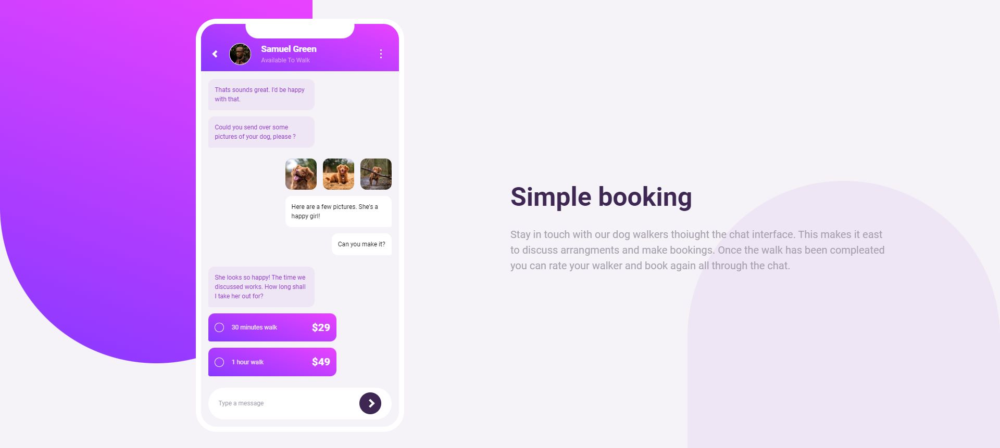
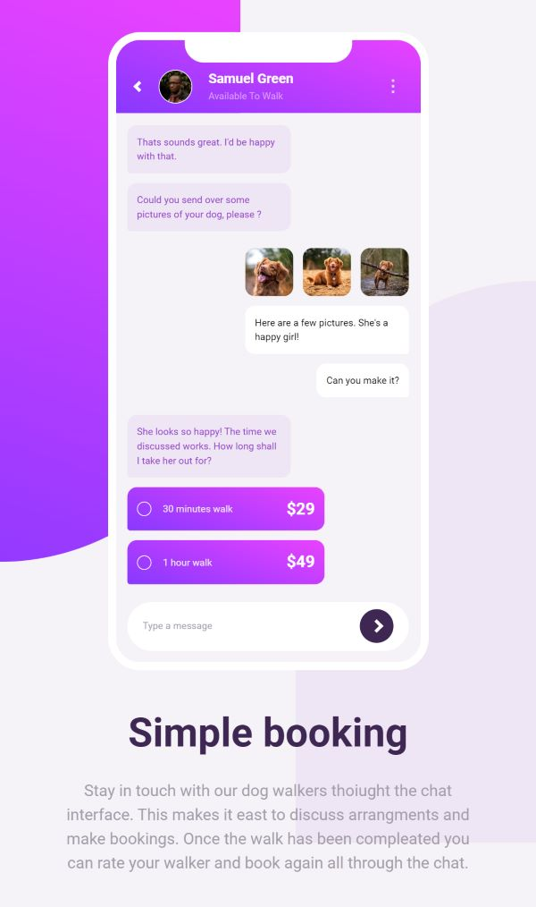

# Chat app CSS illustration

## Table of contents

- [Overview](#overview)
  - [The challenge](#the-challenge)
  - [Screenshot](#screenshot)
- [My process](#my-process)
  - [Built with](#built-with)
  - [What I learned](#what-i-learned)
  - [Useful resources](#useful-resources)
- [Author](#author)

## Overview

### Screenshot

## My process

### Built with

- SASS / SCSS
- [Gulp.js](https://gulpjs.com/) - Task manager
- Semantic HTML5 markup
- CSS custom properties
- Flexbox
- CSS Grid
- Mobile-first workflow

### What I learned
This is my first project using SCSS and task manager. The development seemed a bit unusual because of the tons of posobilites that SASS provides and the ability to organize styles in different files. I mostly practiced using mixins, nesting, and extensions. Variables within the root were generated using for and map loops, which was also a bit unusual. To organize everything I tried using [7-1 folder structure](https://gist.github.com/rveitch/84cea9650092119527bc) and became more familiar with it. Comilation of SASS was handled by gulp task manager.

### Useful resources
- [SASS series by NetNinja](https://www.youtube.com/watch?v=xPuYbmmPdEM&list=PL4cUxeGkcC9hk02lFb6EkdXF2DYGl4Gg4&pp=iAQB) - Get started with SASS fundamentals
- [SASS organization](https://youtu.be/9Ld-aOKsEDk?feature=shared) - A video from Kevin Powell reviewing organization of styling files.

## Author

- Frontend Mentor - [@DaniilGurski](https://www.frontendmentor.io/profile/DaniilGurski)
